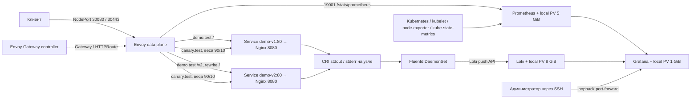

# Архитектура

Профиль рассчитан на выделенную Ubuntu 24.04 amd64 VM с kubeadm, containerd и Calico VXLAN. Это воспроизводимый single-node стенд с постоянным локальным хранилищем, без привязки к облачному LoadBalancer или личному registry.

## Ресурсы и границы

| Namespace | Ресурсы |
| --- | --- |
| `demo` | Deployment/Service `demo-v1` (2 реплики), `demo-v2` (1), Gateway `demo`, HTTPRoute `demo`/`canary`, EnvoyProxy `demo-proxy`, Secret `demo-tls`, NetworkPolicy `demo-ingress` |
| `envoy-gateway-system` | Helm release `eg`, controller и сгенерированный Envoy data plane с 2 репликами |
| `observability` | Releases `monitoring`/`loki`, DaemonSet `fluentd`, PodMonitor Envoy, PrometheusRule, dashboard |
| cluster scope | GatewayClass `eg`, StorageClass `mtc-local`, PV `mtc-prometheus`, `mtc-loki`, `mtc-grafana` |

Pod CIDR — `10.244.0.0/16`, Service CIDR — `10.96.0.0/12`. Preflight проверяет пересечение с сетью основного интерфейса. На single-node control-plane разрешено размещение workloads; строгая межузловая anti-affinity не используется. NodePort имеет `externalTrafficPolicy: Cluster`.

TLS завершается в Envoy. Локальный CA и сертификат создаются один раз; SAN содержит `demo.test` и `canary.test`. Hostname маршрутизация остается задачей HTTPRoute. Путь `/v2` и его подпути полностью переписываются в `/` для backend v2. Canary веса относятся к запросам; конечная выборка не обязана быть точно 90/10.

Приложение работает непривилегированным пользователем с read-only root filesystem, probes и ресурсными requests/limits. NetworkPolicy разрешает ingress только от выбранных Envoy-подов и запрещает egress приложения. Fluentd требуется root для чтения host log files; у него нет Kubernetes API token, host logs смонтированы read-only, корневая файловая система read-only, лишние capabilities сняты.

## Данные и отказоустойчивость

PV используют `kubernetes.io/no-provisioner`, `WaitForFirstConsumer`, nodeAffinity и `Retain`. Каталоги: `/var/lib/mtc-hack/prometheus`, `/var/lib/mtc-hack/loki`, `/var/lib/mtc-hack/grafana`. Fluentd хранит позиции чтения и file buffer в `/var/lib/mtc-hack/fluentd`; лимит буфера 512 MiB, при заполнении backpressure, retries с backoff.

CRI envelope разбирается перед соединением частичных сообщений; stdout/stderr и файлы контейнеров разделены. После concat JSON access-log дополняется полями, текст error-log сохраняется. Loki labels: `app=demo`, `namespace=demo`, `stream=stdout|stderr`. Кардинальность не зависит от URI или UUID.

Prometheus хранит до 24 часов / 3 GB блоков; WAL и рабочие данные требуют дополнительного места. Loki использует TSDB/v13/filesystem, retention 24 часа, compactor и дополнительную задержку удаления 1 час. Значение PV capacity — декларация для Kubernetes, **не filesystem quota**. Loki не очищает данные по факту низкого свободного места. Узловой диск нужно контролировать отдельно.

Рестарт Pod не удаляет локальные данные; потеря VM может потерять все данные и сервис. Система не обещает exactly-once: retries могут дать дубликаты, слишком долгий сбой может привести к ротации непрочитанных логов, concat держит незавершенные фрагменты в памяти. Backup/restore и многозонная HA в профиль не входят.

## Доказательства работы

`verify.sh` выполняет независимые запросы через NodePort, проверяет Gateway status, TLS, статистику canary, рост фактически найденного Envoy counter и UUID в обоих потоках Loki. Prometheus/Loki доступны проверке через временные loopback port-forward. JSON/JUnit описывают фактически выполненные проверки; отсутствие кластера или метрик дает ошибку.

Факты развертывания, перезапуска и повторного deploy должны сопровождаться SHA и протоколом в [validation.md](validation.md). Существование манифестов, dashboard или workflow само по себе таких испытаний не доказывает.
